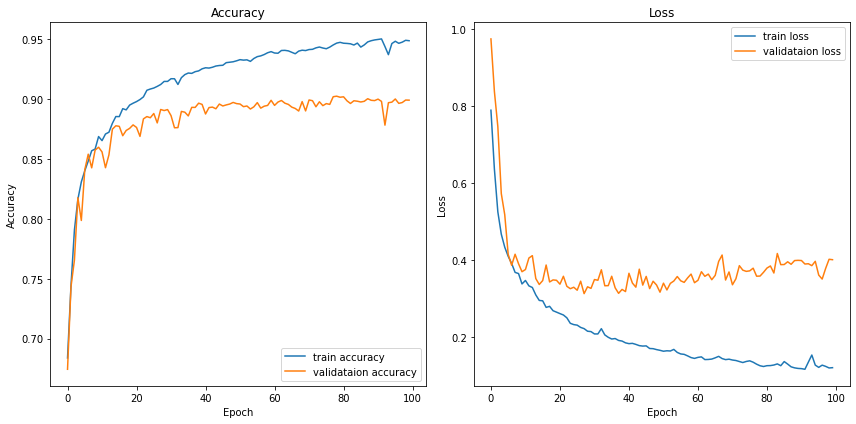
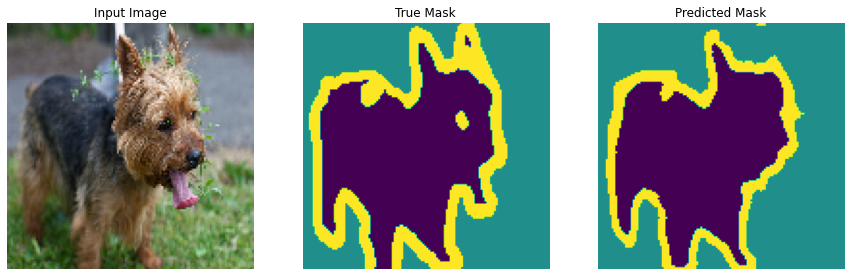
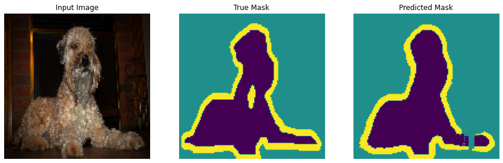
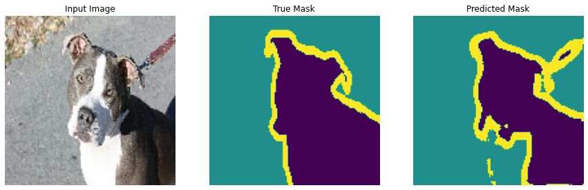

# [TF] Attention Unet in Segmentation

## Introduction

Here is my experiment with segmentation using Attention Unet. In this project, I created a U-net model with 4 encoder blocks and 4 decoder blocks. In the skip connection bridges, I added in the attention component so the model can learn to focus on important areas of the input image.

## Motivation

After learning about the U-net model, I read about the paper of Attention U-net and wanted to implement the attention mechanism in the segmentation problem.

## Dataset:

| Dataset                | Classes |    #Train images      |        #test images        |
|------------------------|:-------:|:---------------------:|:--------------------------:|
| oxford_iiit_pet        |   3     |          3,669        |             3,680          |

  
- **oxford_iiit_pet**:
  The Oxford-IIIT pet dataset has the segmentation mask labels to train the model in segmentation. The labels have 3 channels to represent the background, the object and the object's boundary. The Oxford-IIIT pet dataset is a 37 category pet image dataset with roughly 200 images for each class but we don't care about the classes in this segmentation problem. The input image size is 128x128.

## Model architecture
The model is a U-net model with 4 encoder blocks and 4 decoder blocks. In the skip connection bridges, I added in an attention mechanism following the paper "Attention U-Net: Learning Where to Look for the Pancreas" Oktay et al.

## Results

The model achieved the highest accuracy of ~90% after 100 epochs. While testing, most of the masks are good enough, only minor errors.

   
  <i>Accuracy and loss during training.</i>

   
  <i>Test the prediction.</i>

   
  <i>Test the prediction.</i>

   
  <i>Test the prediction.</i>

